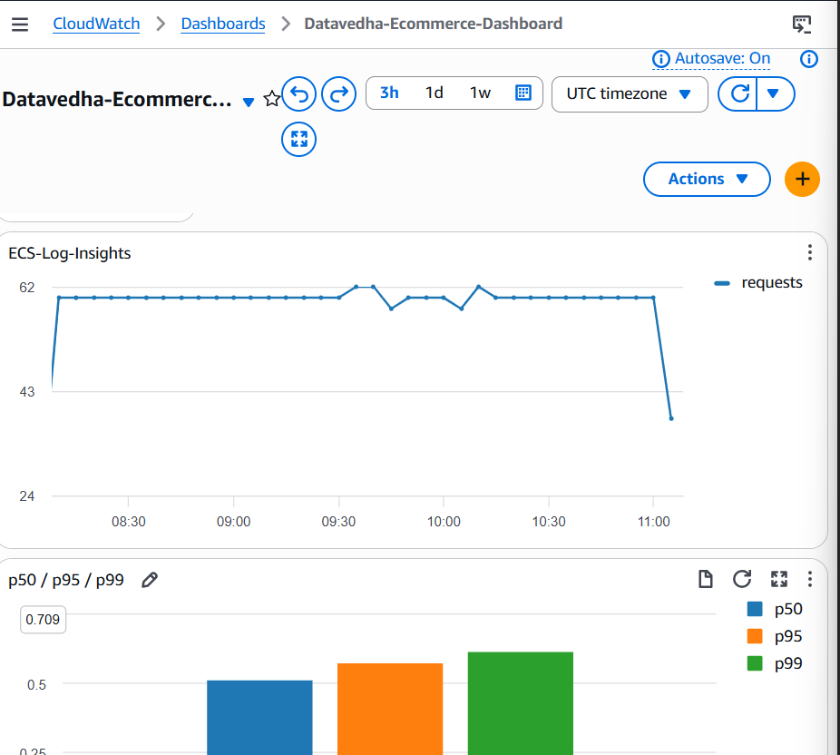
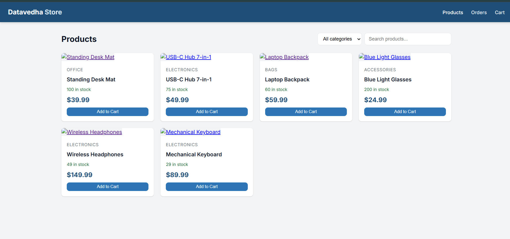
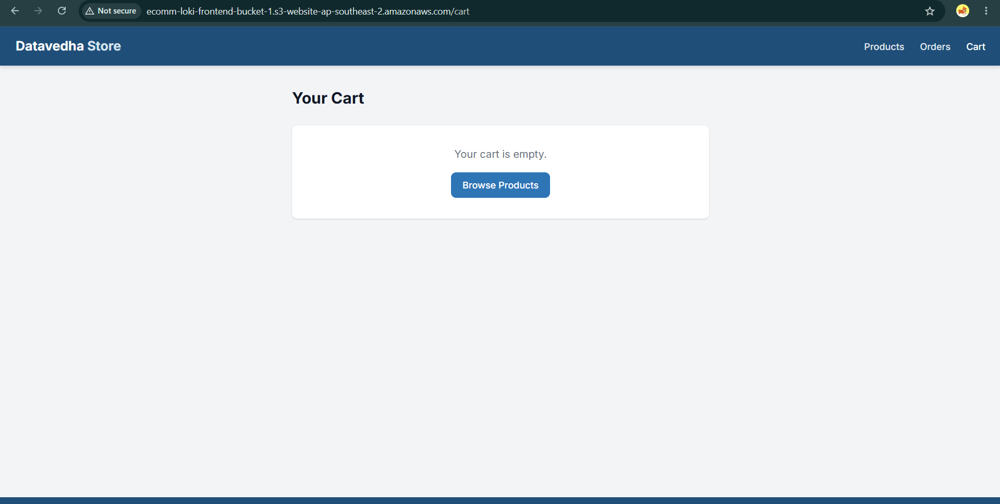
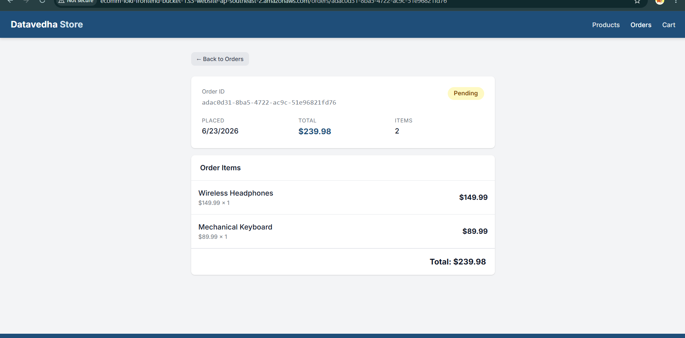
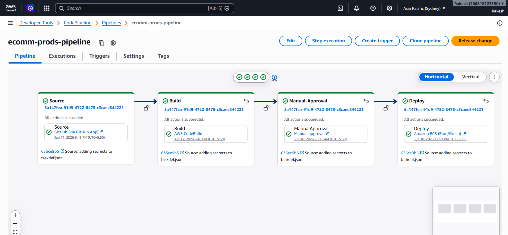

# Datavedha Store — AWS DevOps E-Commerce Platform

A cloud-native e-commerce platform built as part of the **Datavedha Analytics AWS DevOps Apprenticeship** under **Poornachand Kalyampudi**.

The project demonstrates how a containerized microservices application can be built, deployed, and monitored on AWS using **Amazon ECS Fargate, Amazon ECR, Application Load Balancer, Amazon RDS PostgreSQL, Amazon S3, Amazon CloudFront, AWS CodePipeline, AWS CodeBuild, AWS CodeDeploy, AWS Secrets Manager, Terraform, and Amazon CloudWatch**.

---

## Architecture

```text
                         Users
                           |
                           v
                    Amazon CloudFront
                           |
                           v
                  +-------------------+
                  |  Frontend on S3   |
                  |   React + Vite    |
                  +-------------------+

                           |
                           v
                    Application Load
                       Balancer
                           |
                 +---------+---------+
                 |                   |
                 v                   v
          ECS Fargate          ECS Fargate
       products-service       orders-service
          :3000                   :8000
                 |                   |
                 |                   |
                 +---------+---------+
                           |
                           v
                   RDS PostgreSQL
                    (Private Subnet)

CI/CD:
GitHub -> CodePipeline -> CodeBuild -> Manual Approval -> CodeDeploy
                                                       |
                                                       v
                                             ECS Blue/Green Deployment

Monitoring:
ECS / Application Logs -> CloudWatch Logs / CloudWatch Dashboard
```

---

## Application

**Datavedha Store** is a full-stack e-commerce application with a React frontend and two backend microservices.

### Services

| Service | Technology | Port | Responsibility |
|---|---|---:|---|
| `products-service` | Node.js / Express | 3000 | Product catalogue and stock management |
| `orders-service` | Python / FastAPI | 8000 | Order creation and order lifecycle |
| `frontend` | React / Vite | 80 | E-commerce storefront |

The orders service communicates with the products service to validate product and stock information before processing an order.

---

## AWS Infrastructure

### Networking

The application is deployed using an AWS VPC with public and private subnets.

```text
AWS VPC
|
+-- Public Subnets
|    +-- Application Load Balancer
|    +-- NAT Gateway
|
+-- Private Subnets
     +-- ECS Fargate Tasks
     +-- RDS PostgreSQL
```

Security is implemented using separate security groups for the load balancer, ECS services, and database.

### Compute & Containers

- **Amazon ECS Fargate** runs the backend microservices without managing EC2 worker nodes.
- **Amazon ECR** stores the container images.
- ECS task definitions define the containers, networking, environment configuration, and secrets.

### Database

- **Amazon RDS PostgreSQL** is deployed in private subnets.
- Database credentials are supplied to ECS using **AWS Secrets Manager**.

### Frontend

The React frontend is built as a static application and hosted using **Amazon S3**.

**Amazon CloudFront** is used as the CDN layer for frontend delivery.

---

## CI/CD Pipeline

The project uses an AWS-native CI/CD pipeline:

```text
Developer
    |
    v
GitHub
    |
    v
AWS CodePipeline
    |
    v
AWS CodeBuild
    |
    v
Manual Approval
    |
    v
AWS CodeDeploy
    |
    v
ECS Blue/Green Deployment
```

The implemented pipeline contains these stages:

1. **Source** — retrieves application changes from GitHub.
2. **Build** — AWS CodeBuild builds and prepares the application/container deployment artifacts.
3. **Manual Approval** — deployment requires an explicit approval before production deployment.
4. **Deploy** — AWS CodeDeploy performs an ECS Blue/Green deployment.

### Blue/Green Deployment

The ECS deployment strategy separates the existing environment from the new version so that a new release can be validated before traffic is switched.

```text
                    ALB
                     |
              +------+------+
              |             |
              v             v
          Blue ECS       Green ECS
        current version   new version
              |             |
              +------+------+
                     |
              traffic switch
```

---

## Monitoring & Observability

Application and ECS activity is monitored using **Amazon CloudWatch**.

The project includes a CloudWatch dashboard with application metrics/log insights, including request activity and latency percentile information such as:

```text
p50
p95
p99
```

Example dashboard:



This provides a way to observe application behavior after deployment instead of relying only on the application UI.

---

# Application Screenshots

## Products

The deployed storefront displays products with category, stock, price, search, filtering, and add-to-cart functionality.



## Cart

Users can add products to the shopping cart and review their cart before placing an order.



## Order Details

The application displays the created order, order status, items, quantities, and total amount.



---

# CI/CD Pipeline Screenshot

The AWS CodePipeline execution shows the complete deployment flow:

```text
Source
   |
Build
   |
Manual Approval
   |
Deploy
```



---

## Local Development

### Prerequisites

- Docker & Docker Compose
- Node.js 20
- Python 3.12

### Run with Docker Compose

```bash
docker compose up --build
```

Example local endpoints:

| URL | Service |
|---|---|
| `http://localhost` | Frontend |
| `http://localhost:3000/api/products` | Products API |
| `http://localhost:8000/api/orders` | Orders API |
| `http://localhost:8000/docs` | Orders API Swagger |

### Run services individually

#### Products service

```bash
cd products-service
cp .env.example .env
npm install
npm run dev
```

#### Orders service

```bash
cd orders-service
cp .env.example .env
pip install -r requirements.txt
uvicorn main:app --reload --port 8000
```

#### Frontend

```bash
cd frontend
npm install
npm run dev
```

---

## Testing

### Products service

```bash
cd products-service
npm test
```

### Orders service

```bash
cd orders-service
pytest tests/ -v
```

### Frontend build

```bash
cd frontend
npm run build
```

---

## Infrastructure as Code

The AWS infrastructure is managed using **Terraform**.

The `terraform/` directory contains the infrastructure configuration for the AWS environment.

The infrastructure covers resources such as:

- VPC and subnets
- Route tables
- Internet Gateway / NAT Gateway
- Security groups
- ECS cluster and services
- ECS task definitions
- ECR repositories
- Application Load Balancer
- Target groups
- RDS PostgreSQL
- IAM roles and policies
- AWS Secrets Manager integration
- S3 frontend hosting
- CloudFront
- CI/CD resources

---

## Project Structure

```text
.
├── products-service/
│   ├── src/
│   │   ├── app.js
│   │   ├── index.js
│   │   ├── routes/
│   │   ├── db/
│   │   └── middleware/
│   ├── tests/
│   └── Dockerfile
│
├── orders-service/
│   ├── main.py
│   ├── app/
│   │   ├── config.py
│   │   ├── models.py
│   │   ├── routes/
│   │   ├── db/
│   │   └── middleware/
│   ├── tests/
│   └── Dockerfile
│
├── frontend/
│   ├── src/
│   │   ├── api/
│   │   ├── components/
│   │   └── pages/
│   ├── Dockerfile
│   └── nginx.conf
│
├── terraform/
├── docker-compose.yml
├── .github/
│   └── workflows/
│       └── ci.yml
└── docs/
    └── screenshots/
```

---

## Key DevOps Concepts Demonstrated

- AWS VPC networking
- Public and private subnets
- Security groups
- IAM roles and least-privilege access
- Docker containerization
- Amazon ECR
- Amazon ECS Fargate
- Application Load Balancer
- ECS service discovery / service-to-service communication
- Amazon RDS PostgreSQL
- AWS Secrets Manager
- Amazon S3 static frontend hosting
- Amazon CloudFront
- Terraform Infrastructure as Code
- AWS CodePipeline
- AWS CodeBuild
- AWS CodeDeploy
- ECS Blue/Green deployments
- Manual deployment approval
- Amazon CloudWatch
- Application log analysis
- Request/latency monitoring

---

## Cost-Aware Demonstration

The AWS environment does not need to remain running continuously.

Because resources such as ECS, RDS, NAT Gateway, load balancers, and other AWS services can generate charges, the infrastructure can be provisioned when needed for demonstrations and removed when the demonstration is complete.

The project is therefore designed around:

```text
Terraform
   |
   v
terraform apply
   |
   v
AWS Environment
   |
   v
Test / Demonstrate
   |
   v
terraform destroy
```

The repository, Terraform configuration, screenshots, architecture, and CI/CD configuration provide a reproducible record of the implementation without requiring the production environment to run 24/7.

---

## Mentor

**Poornachand Kalyampudi**  
Datavedha Analytics — AWS DevOps Apprenticeship  
2026
